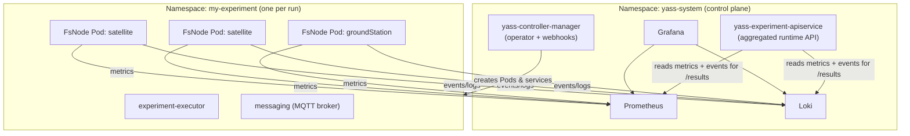

# YASS — Installation Guide

YASS (Yet Another Satellite Simulator) is a Kubernetes operator that simulates a
constellation of satellites and ground stations and the networking between them.
It is used to run reproducible experiments — for example, comparing distributed
file-systems (such as an IPFS-based engine) against a classic point-to-point
transfer engine under realistic orbital line-of-sight conditions.

This guide covers everything needed to get YASS running on a **clean cluster**.
For writing and running experiments once it is installed, see the
[User Guide](./USER-GUIDE.md).

---

## Table of contents

1. [Architecture at a glance](#architecture-at-a-glance)
2. [Prerequisites](#1-prerequisites)
   - [1.a Kubernetes cluster (and a KinD alternative)](#1a-kubernetes-cluster-and-a-kind-alternative)
   - [1.b kubectl](#1b-kubectl)
3. [Installing the operator](#2-installing-the-operator)
   - [One-command install](#one-command-install)
   - [What gets installed](#what-gets-installed)
   - [Step-by-step alternative](#step-by-step-alternative)
   - [Private images (GHCR pull secret)](#private-images-ghcr-pull-secret)
   - [Pinning image versions](#pinning-image-versions)
   - [Sizing the control plane](#sizing-the-control-plane)
   - [Verifying the installation](#verifying-the-installation)
   - [Accessing the observability stack](#accessing-the-observability-stack)
   - [Uninstalling](#uninstalling)

---

## Architecture at a glance

YASS installs a small **control plane** into a single system namespace
(`yass-system` by default). Each experiment then runs in **its own namespace**,
where the operator materialises one Pod per simulated node. Metrics and events
flow into a shared **observability** stack.



---

## 1. Prerequisites

### 1.a Kubernetes cluster (and a KinD alternative)

YASS runs on any conformant Kubernetes cluster (v1.27+). You need:

- A cluster you can reach with `kubectl` and a context that has cluster-admin
  rights (the installer creates CRDs, cluster-scoped RBAC, webhooks and an
  aggregated `APIService`).
- Worker capacity proportional to your experiments — every simulated node is a
  Pod, and its CPU/memory requests come from the `HardwareDefinition` you assign
  to it.
- A control plane sized for the **rate of API operations**, not just the worker
  footprint — see [Sizing the control plane](#sizing-the-control-plane).

#### Local cluster with KinD

For development and small experiments, [KinD](https://kind.sigs.k8s.io/)
(Kubernetes in Docker) is the quickest way to get a cluster. You need Docker (or
Podman) and the `kind` binary.

Install `kind`:

```bash
go install sigs.k8s.io/kind@v0.27.0
# or download a release binary:
curl -Lo ./kind https://kind.sigs.k8s.io/dl/v0.27.0/kind-linux-amd64
chmod +x ./kind && sudo mv ./kind /usr/local/bin/kind
```

Create a single-node cluster named `yass`:

```bash
kind create cluster --name yass
```

A minimal cluster config is also kept in the repository as `kind-cluster.yaml`.
Use it when you need a named cluster and/or container-registry mirrors:

```bash
kind create cluster --config kind-cluster.yaml
```

Verify the cluster is up and your context points at it:

```bash
kubectl cluster-info --context kind-yass
kubectl get nodes
```

> **Note on KinD and capacity.** A single-node KinD cluster runs the control
> plane and the workload on the same machine. It is fine for a handful of nodes
> (the [`networking-demo`](../../yass-experiments/experiments/networking-demo)
> example), but it is **not** suitable for large constellations or many parallel
> experiments. Use a real multi-node cluster for those.

### 1.b kubectl

All interaction with YASS — installing, launching experiments, monitoring,
fetching results — is done with `kubectl`. Install a version within one minor of
your cluster:

```bash
curl -LO "https://dl.k8s.io/release/$(curl -L -s https://dl.k8s.io/release/stable.txt)/bin/linux/amd64/kubectl"
chmod +x kubectl && sudo mv kubectl /usr/local/bin/kubectl
```

Verify it can reach the cluster:

```bash
kubectl version
kubectl get nodes
```

---

## 2. Installing the operator

The repository ships an **installer** — `install.sh` plus the pre-built
manifests under `dist/`. There is no Helm chart; everything is plain
`kubectl apply`, so the install is idempotent and re-runnable.

The installer applies three layers, in order:

1. **cert-manager** — a cluster prerequisite for the operator's admission
   webhooks (applied with `--wait`).
2. **yass-operator** (`dist/install.yaml`) — the system namespace, all CRDs,
   RBAC, webhooks, the cert-manager `Certificate`/`Issuer`, the operator
   (`yass-controller-manager`) and the aggregated runtime API
   (`yass-experiment-apiservice` + the `v1.runtime.esa.yass` `APIService`).
3. **observability** (`dist/observability`) — Prometheus, Loki and Grafana.

### One-command install

From the repository root (where `install.sh` and `dist/` live):

```bash
./install.sh
```

Common options:

```bash
./install.sh \
  --kubeconfig /path/to/kubeconfig \      # target a specific cluster (else current context)
  --namespace yass-system \               # system namespace (default: yass-system)
  --operator-tag e6877834 \               # pin the operator image tag
  --ghcr-user <user> --ghcr-token <token> # pull secret for private images
```

To skip a layer you already manage yourself:

```bash
./install.sh --no-cert-manager      # cert-manager already present
./install.sh --no-observability     # bring your own Prometheus/Loki/Grafana
```

See `./install.sh --help` for the full list.

### What gets installed

| Layer | Object | Namespace | Notes |
|---|---|---|---|
| cert-manager | Deployments, CRDs, webhooks | `cert-manager` | Default version `v1.19.1`; override with `--cert-manager-version`. |
| Operator | `Namespace`, 5 CRDs (`int.esa.yass`), RBAC, webhooks | cluster + `yass-system` | CRDs: `experiments`, `fsnodes`, `experimentdefinitions`, `layouts`, `hardwaredefinitions`. |
| Operator | `Certificate` + `Issuer` | `yass-system` | Serving certs for the admission webhooks. |
| Operator | `Deployment/yass-controller-manager` | `yass-system` | The reconciler that turns CRs into Pods. |
| Runtime API | `Deployment/yass-experiment-apiservice` + `APIService v1.runtime.esa.yass` | `yass-system` + cluster | Aggregated API exposing each experiment's live state and downloadable results. |
| Observability | Prometheus, Loki, Grafana | `yass-system` | Metrics, events/logs, dashboards. |

### Step-by-step alternative

If you prefer to drive each step yourself instead of `install.sh`:

```bash
# 1. cert-manager
kubectl apply -f https://github.com/cert-manager/cert-manager/releases/download/v1.19.1/cert-manager.yaml
kubectl -n cert-manager rollout status deploy/cert-manager-webhook --timeout=300s

# 2. operator: namespace, CRDs, RBAC, webhooks, manager, apiservice
kubectl apply -f dist/install.yaml
kubectl wait --for=condition=Established \
  crd/experiments.int.esa.yass crd/fsnodes.int.esa.yass \
  crd/experimentdefinitions.int.esa.yass crd/layouts.int.esa.yass \
  crd/hardwaredefinitions.int.esa.yass --timeout=120s
kubectl -n yass-system rollout status deploy/yass-controller-manager --timeout=300s

# 3. observability
kubectl apply -k dist/observability
```

### Private images (GHCR pull secret)

The operator, internal components and engines are published to GHCR. If the
images are private, create a pull secret in the system namespace (the installer
does this for you when `--ghcr-user`/`--ghcr-token` are passed):

```bash
kubectl -n yass-system create secret docker-registry docker-secret \
  --docker-server=ghcr.io \
  --docker-username=<user> \
  --docker-password=<token>
```

### Pinning image versions

For reproducible installs, pin concrete tags rather than `latest`:

- **Operator image** — set at install time:

  ```bash
  ./install.sh --operator-tag e6877834
  # or, on an existing install:
  kubectl -n yass-system set image deploy/yass-controller-manager \
    manager=ghcr.io/duobitx/yass-operator:e6877834
  kubectl -n yass-system rollout status deploy/yass-controller-manager
  ```

- **Internal components** — the operator stamps every FsNode Pod with the
  `INTERNAL_COMPONENTS_VERSION` it carries. Pin it with:

  ```bash
  ./install.sh --internal-components-version <tag>
  ```

- **Runtime API image** — the `yass-experiment-apiservice` Deployment runs a
  build of `ghcr.io/duobitx/yass-internal-components`. Pin it to the same tag for
  consistency:

  ```bash
  kubectl -n yass-system set image deploy/yass-experiment-apiservice \
    apiservice=ghcr.io/duobitx/yass-internal-components:<tag>
  ```

### Sizing the control plane

> **Important.** For large experiments — many FsNodes — and/or several
> experiments running in parallel, the cluster **control plane (API server +
> etcd), not the worker nodes, is usually the first bottleneck.** Every FsNode is
> a Pod and the simulation drives a high rate of API operations (status updates,
> fault-event churn, Pod lifecycle). An undersized control plane can become
> unresponsive and stall or fail otherwise-healthy runs even when the workers are
> nearly idle.
>
> Size the control-plane nodes accordingly (CPU and memory headroom on the API
> server and etcd) and cap how many experiments run at once. A single experiment
> may declare at most **256 FsNodes** (satellites + ground stations combined),
> enforced by the admission webhook.

### Verifying the installation

```bash
# Operator and runtime API up
kubectl -n yass-system get pods

# CRDs registered
kubectl get crds | grep int.esa.yass

# Aggregated runtime API available
kubectl get apiservices | grep runtime.esa.yass
```

You should see `yass-controller-manager` and `yass-experiment-apiservice`
`Running`, five `int.esa.yass` CRDs, and the `v1.runtime.esa.yass` APIService
reporting `Available: True`.

### Accessing the observability stack

Port-forward the services from the system namespace:

```bash
# Grafana dashboards
kubectl -n yass-system port-forward svc/grafana 3000:3000
# -> http://localhost:3000   (default login: admin / yass-admin)

# Prometheus (PromQL)
kubectl -n yass-system port-forward svc/prometheus 9090:9090
# -> http://localhost:9090
```

Grafana ships pre-provisioned dashboards (Overview, fsNode drill-down, TUS vs
EDFS comparison, Events, Timeline). They are described in the
[User Guide → Monitoring](./USER-GUIDE.md#4a-monitoring-an-experiment-and-its-fsnodes).

### Uninstalling

```bash
# Remove observability and the operator
kubectl delete -k dist/observability
kubectl delete -f dist/install.yaml

# Optionally remove cert-manager
kubectl delete -f https://github.com/cert-manager/cert-manager/releases/download/v1.19.1/cert-manager.yaml
```

Deleting `dist/install.yaml` removes the CRDs, which cascades to every YASS
custom resource on the cluster. Delete your experiment namespaces first if you
want a graceful teardown (see
[User Guide → deleting an experiment](./USER-GUIDE.md#deleting-an-experiment)).
