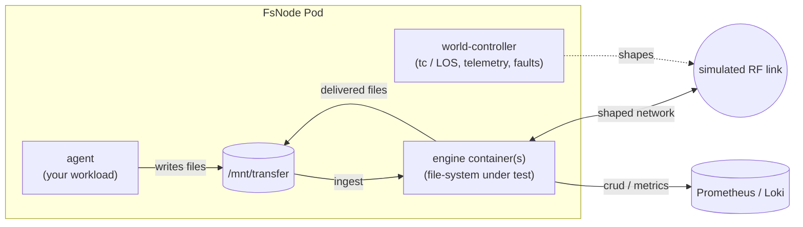
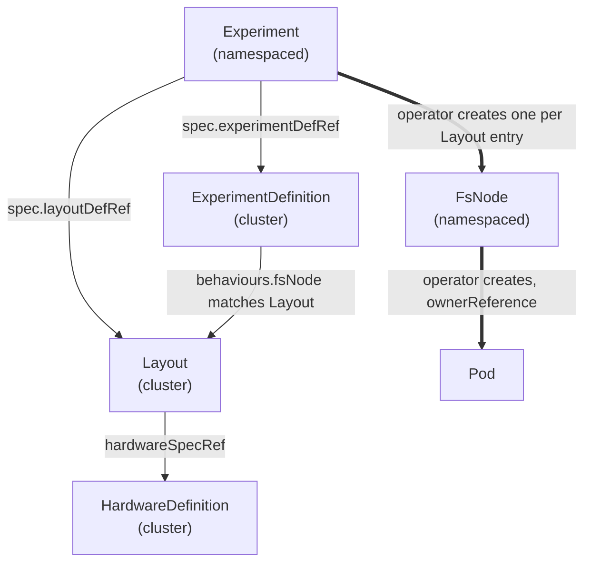
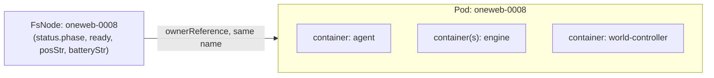
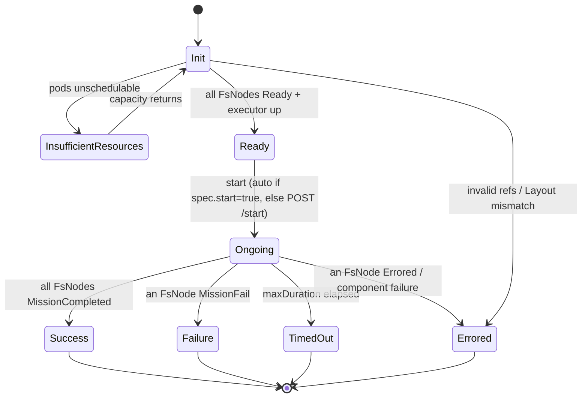
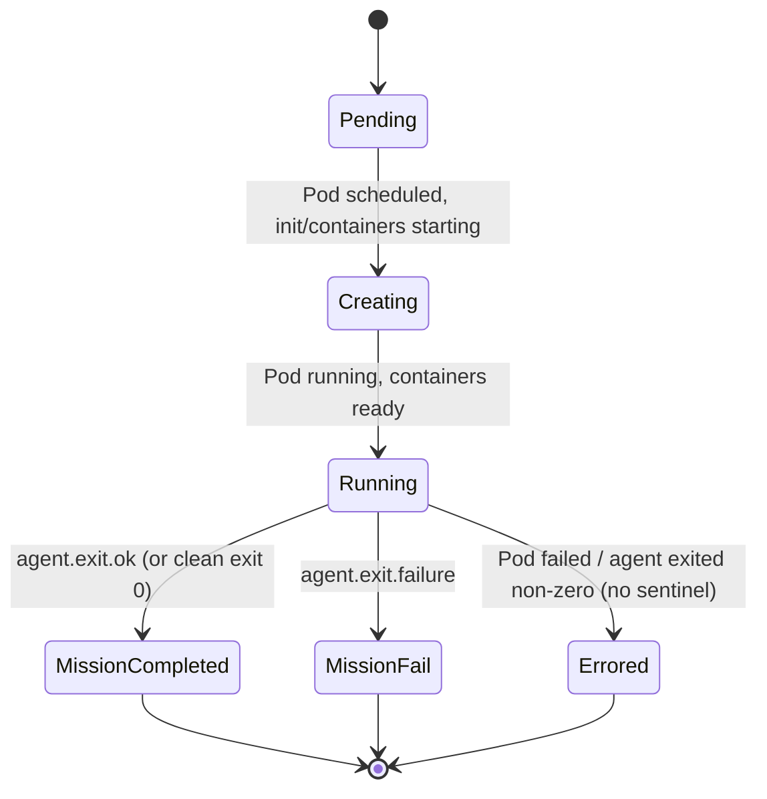
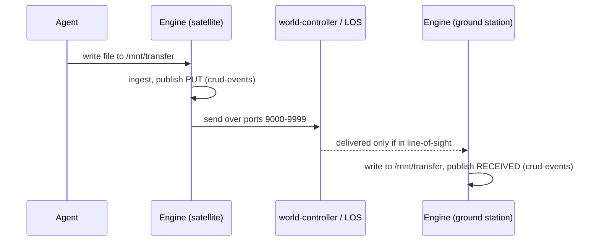

# YASS — User Guide

This guide explains how the YASS simulator works and how to author, run, monitor
and analyse experiments. For getting YASS onto a cluster, see the
[Installation Guide](./INSTALLATION.md).

---

## Table of contents

3. [How the simulator works](#3-how-the-simulator-works)
   - [3.a Custom Resources](#3a-custom-resources)
   - [3.b Relationships between the resources](#3b-relationships-between-the-resources)
   - [3.c Using kubectl (and `kubectl explain` as live docs)](#3c-using-kubectl-and-kubectl-explain-as-live-docs)
   - [3.d Auto-start (`spec.start`) and `evictResourcesAfter`](#3d-auto-start-specstart-and-evictresourcesafter)
   - [3.e The runtime APIService](#3e-the-runtime-apiservice)
   - [3.f Limitations](#3f-limitations)
4. [Writing and running an experiment](#4-writing-and-running-an-experiment)
   - [4.a Monitoring an experiment and its FsNodes](#4a-monitoring-an-experiment-and-its-fsnodes)
   - [4.b How an FsNode maps to a Pod](#4b-how-an-fsnode-maps-to-a-pod)
   - [4.c Statuses and transitions](#4c-statuses-and-transitions)
5. [Results](#5-results)
   - [5.a Downloading results as Parquet](#5a-downloading-results-as-parquet)
   - [5.b What is inside the Parquet data](#5b-what-is-inside-the-parquet-data)
6. [Writing and using your own agent](#6-writing-and-using-your-own-agent)
   - [6.a How to signal success / failure](#6a-how-to-signal-success--failure)
7. [Writing and using your own engine](#7-writing-and-using-your-own-engine)
8. [A full example experiment](#8-a-full-example-experiment)

---

## 3. How the simulator works

YASS models a world of **FsNodes** — each one is either a *satellite* or a
*ground station* — and the line-of-sight (LOS) networking between them. Each
FsNode is realised as a Kubernetes Pod that contains:

- an **agent** — your workload: it decides *what the node does* (take a photo,
  produce a file, wait to receive data, …);
- one or more **engine** containers — the file-system under test (for example a
  classic point-to-point transfer engine, or a distributed IPFS-based engine);
- a **world-controller** sidecar (injected automatically) — it shapes the Pod's
  network with Linux `tc` so peers are only reachable while they are in
  line-of-sight, propagates simulated position/battery telemetry, and injects
  scheduled hardware faults.

Agents and engines exchange files through a shared `/mnt/transfer` directory; the
engine moves files across the simulated network to other nodes. The whole run is
orchestrated by the **experiment-executor** and reflected back into the custom
resources by the operator.



### 3.a Custom Resources

YASS defines five custom resources in the API group **`int.esa.yass/v1`**:

| Kind | Scope | Purpose |
|---|---|---|
| **`Layout`** | Cluster | The world topology: the list of nodes, each with a type, an orbit (satellite) or fixed position (ground station), and a hardware profile. |
| **`HardwareDefinition`** | Cluster | A reusable hardware profile: CPU, memory, disk, and a simulated battery/energy model. |
| **`ExperimentDefinition`** | Cluster | The scenario: which agent runs on each node, any scheduled hardware faults, and the overall `maxDuration`. |
| **`Experiment`** | Namespaced | One concrete run: references a `Layout` and an `ExperimentDefinition`, picks the engine, and controls start/cleanup. |
| **`FsNode`** | Namespaced | One simulated node. **Created by the operator** from the Layout — you normally do not author these directly; they are the join of a Layout entry, its hardware, the chosen engine and the matching agent behaviour. |

The first three are **cluster-scoped catalogue** objects you can reuse across many
runs. An `Experiment` is the namespaced object that ties them together; applying
it produces the `FsNode`s and their Pods.

Key fields, by resource (use [`kubectl explain`](#3c-using-kubectl-and-kubectl-explain-as-live-docs)
for the authoritative, always-current field docs):

- **`Layout.spec[]`** — a keyed list of nodes. Each entry:
  - `fsNode` — the node's name (also becomes the `FsNode`/Pod name; must be a
    DNS-1123 label).
  - `nodeType` — `satellite` or `groundStation`.
  - `orbit.tle` — a two-line element set (satellites), propagated with SGP4; **or**
    `earthPosition` — `lat`/`lng`/`heightOverSeaLevel` (ground stations). Exactly
    one of the two is required.
  - `hardwareSpecRef` (name of a `HardwareDefinition`) **or** an inline
    `hardwareSpec`.
  - `properties` — a free-form `map[string]string` injected as environment
    variables into that node's containers (e.g. `IS_TARGET_GS: "true"`).

- **`HardwareDefinition.spec`** — `cpu`, `memory` (used as both the Pod request
  *and* limit), optional `diskSpace` (a hard size limit on the engine's `/tmp`),
  `batteryCapacityWh`, `batteryChargeW`, `lowPowerThresholdWh`, and an
  `energyConsumption` model (`normalPowerBaseW`, `lowPowerBaseW`, and per-kilobyte
  TX / disk-read / disk-write costs).

- **`ExperimentDefinition.spec`** — `maxDuration` (Go duration, e.g. `6h`; when it
  elapses the run is marked `TimedOut`) and `behaviours[]`, a keyed list with one
  entry per node:
  - `fsNode` — must match a Layout entry by name.
  - `agent` — the workload container (`image`, optional `envsMap`, optional
    ConfigMap mount).
  - `hardwareEvents[]` — optional scheduled faults (see below).

- **`Experiment.spec`** — `experimentDefRef`, `layoutDefRef`, `engineContainers`
  (the engine, propagated to every FsNode), optional `engineVolumes`,
  `start` (auto-start switch), `evictResourcesAfter`, `runId`,
  `simulationStartTime`, and `fsNodeProperties` (experiment-wide env overrides).

- **`FsNode`** — the materialised node. Its `status` carries the live
  `phase`, `ready`, `posStr` (position) and `batteryStr`.

**Hardware faults** (`hardwareEvents[]`) let a scenario inject failures. The
`type` is one of `NetworkBandwidthReduced`, `NetworkFailure`, `DiskFull`,
`DiskFailure`, `Destroy`; each has a `startOffset` and either a one-shot
`duration` or a recurring `schedule`.

### 3.b Relationships between the resources



- An **Experiment** points at exactly one **Layout** (`spec.layoutDefRef`) and one
  **ExperimentDefinition** (`spec.experimentDefRef`).
- The **ExperimentDefinition**'s `behaviours[].fsNode` names must line up exactly
  with the **Layout**'s `fsNode` names — every Layout node needs a behaviour.
- Each **Layout** node references a **HardwareDefinition** (or inlines one).
- Applying the Experiment makes the operator create one **FsNode** per Layout
  entry (in the Experiment's namespace), and one **Pod** per FsNode (owned by it).

### 3.c Using kubectl (and `kubectl explain` as live docs)

Because the CRDs carry full field documentation, `kubectl explain` is the
authoritative, always-current reference for every field — no separate schema doc
to drift out of date:

```bash
kubectl explain experiment.spec
kubectl explain experiment.spec.evictResourcesAfter
kubectl explain experimentdefinition.spec.behaviours
kubectl explain layout.spec
kubectl explain hardwaredefinition.spec.energyConsumption
kubectl explain fsnode.status
```

Listing resources uses the print columns baked into each CRD:

```bash
kubectl get layouts                       # cluster-scoped catalogue
kubectl get hardwaredefinitions
kubectl get experimentdefinitions

kubectl -n my-experiment get experiment -o wide
# NAME   EXPERIMENTTIME   STATE     AGE   APISERVERURL
# uc1    2025-12-14T...   Ongoing   5m    /apis/runtime.esa.yass/v1/...

kubectl -n my-experiment get fsnodes
# NAME          NODETYPE        PHASE             READY   BAT        POSOVEREARTH
# oneweb-0008   satellite       Running           true    85% ...    lat=.., lng=..
# new-norcia    groundStation   Running           true    100% ...   lat=.., lng=..
```

FsNodes have the short names `fsn` / `fsns` (`kubectl get fsn`).

### 3.d Auto-start (`spec.start`) and `evictResourcesAfter`

**`spec.start` (auto-start).** Bringing an experiment up (creating Pods, waiting
for the engines and the executor to be ready) is separate from *starting the
simulated clock*. The `start` flag decides which happens automatically:

- `start: true` — the executor begins the run **automatically** as soon as every
  FsNode reports `Ready`. This is the usual choice.
- `start: false` — the experiment comes up and waits in the `Ready` state until
  you trigger it explicitly via the runtime API (see
  [3.e](#3e-the-runtime-apiservice)). Use this when you want everything staged and
  then start several runs at a precise moment.

**`evictResourcesAfter`.** Once an experiment reaches a terminal state
(`Success`, `Failure`, `TimedOut`, `Errored`), its Pods keep consuming CPU and
memory until you clean up. Set `evictResourcesAfter` to a Go duration and the
operator will, that long after the terminal state, delete the resource-consuming
Pods automatically — **while keeping the `Experiment` resource and all metrics and
events** (those already live in Prometheus/Loki), so you can still fetch
[results](#5-results) afterwards. This is the recommended way to free cluster
capacity on a busy cluster:

```yaml
spec:
  start: true
  evictResourcesAfter: 10m   # reclaim Pods 10 minutes after the run ends
```

Leave it unset to keep Pods around indefinitely (e.g. for live debugging). 5m is
the hard minimum; **10m or more is recommended** so any in-flight delivery
accounting settles before the Pods disappear.

### 3.e The runtime APIService

YASS registers an **aggregated Kubernetes API** under the group
`runtime.esa.yass/v1`, served by the `yass-experiment-apiservice` extension.
It exposes each experiment's *live* runtime state and its downloadable results
through the regular Kubernetes API server — no extra port-forward, and it reuses
your `kubectl` credentials.

Every `Experiment` publishes the base path of its runtime API in
`status.apiServerURL`. Read it and append a subresource:

```bash
URL=$(kubectl -n my-experiment get experiment uc1 -o jsonpath='{.status.apiServerURL}')

kubectl get --raw "$URL"           | jq .   # the experiment object (read-through)
kubectl get --raw "$URL/time"      | jq .   # simulated clock + whether it is running
kubectl get --raw "$URL/fsnodes"   | jq .   # all FsNodes with live runtime state
kubectl get --raw "$URL/events"             # server-sent event stream
kubectl get --raw "$URL/results"   > results.zip   # results bundle (Parquet, see §5)
```

To **start** an experiment that was created with `start: false`, either flip the
flag on the resource (simplest — the operator starts it once it is `Ready`):

```bash
kubectl -n my-experiment patch experiment uc1 --type merge -p '{"spec":{"start":true}}'
```

…or POST to the runtime API's `/start` subresource through the Kubernetes API
server (`kubectl get --raw` only issues GET, so use `curl` for the POST):

```bash
curl -sk -X POST \
  -H "Authorization: Bearer $(kubectl create token default -n my-experiment)" \
  "$(kubectl config view --minify -o jsonpath='{.clusters[0].cluster.server}')$URL/start"
```

| Subresource | Method | Returns |
|---|---|---|
| *(base)* | GET | The `Experiment` object (read-through). |
| `/time` | GET | Simulated experiment time and whether the run is ongoing. |
| `/fsnodes` | GET | All FsNodes with identity and live runtime state. |
| `/events` | GET | Server-sent event stream of experiment events. |
| `/start` | POST | Manually start a `start: false` experiment. |
| `/results` | GET | A zip bundle of Parquet files (events + metrics). |

### 3.f Limitations

- **Scale ceiling.** At most **256 FsNodes** per experiment (enforced by the
  admission webhook). At scale the **control plane** is the bottleneck, not the
  workers — see
  [Installation → Sizing the control plane](./INSTALLATION.md#sizing-the-control-plane).
- **One Pod per node.** Each FsNode's CPU/memory come from its
  `HardwareDefinition` and are applied as both request and limit, so the cluster
  must have real capacity for the sum of all nodes.
- **Disk limits are coarse.** `hardwareSpec.diskSpace` caps only the engine's
  `/tmp` (an `emptyDir` size limit enforced by the kubelet as eviction — there is
  no graceful `ENOSPC`). It does not bound `/mnt/transfer`; agents are responsible
  for rotating their own output on long runs.
- **Networking is simulated, not emulated end-to-end.** The world-controller
  shapes traffic with `tc` based on orbital line-of-sight: a peer is reachable
  only while in view. Connectivity, bandwidth caps and fault injection are
  modelled; this is not a packet-accurate RF physical layer.
- **Battery, energy and attitude are modelled.** The battery/energy figures come
  from the `HardwareDefinition` model; node `rotation` (attitude) is informational
  and reserved for future use.
- **Orbits come from TLEs.** Satellite positions are SGP4-propagated from the
  two-line elements you supply; accuracy is bounded by the freshness of those
  TLEs and the chosen `simulationStartTime`.

---

## 4. Writing and running an experiment

An experiment is a set of YAML manifests — typically four authored documents plus
a namespace:

1. `Namespace` — where the run lives.
2. `HardwareDefinition`(s) — the hardware profile(s) (cluster-scoped; reusable).
3. `Layout` — the constellation topology (cluster-scoped; reusable).
4. `ExperimentDefinition` — the per-node agent behaviour and faults
   (cluster-scoped; reusable).
5. `Experiment` — the concrete run that references the Layout and the
   ExperimentDefinition, selects the engine, and sets `start`/`evictResourcesAfter`
   (namespaced).

A `kustomization.yaml` listing them lets you apply everything in one command and
in the right order (cluster-scoped catalogue before the namespaced Experiment):

```bash
kubectl apply -k experiments/my-experiment
```

On apply, the operator creates the experiment infrastructure (the
`experiment-executor`, the `messaging` MQTT broker, the metrics bridge), one
`FsNode` per Layout entry, and one Pod per FsNode. With `start: true` the run
begins as soon as all nodes are `Ready`. See [§8](#8-a-full-example-experiment)
for a complete, runnable example.

### 4.a Monitoring an experiment and its FsNodes

**With kubectl.** Watch the experiment state and the per-node phases/positions:

```bash
kubectl -n my-experiment get experiment -w
kubectl -n my-experiment get fsnodes -w
```

Inspect a single node's containers. Every FsNode Pod has an `agent` container,
one or more engine containers, and the `world-controller` sidecar:

```bash
kubectl -n my-experiment logs <fsnode> -c agent              # your workload
kubectl -n my-experiment logs <fsnode> -c world-controller   # networking / telemetry
kubectl -n my-experiment logs <fsnode> -c <engine-container> # the file-system engine
```

**With the runtime API** (no port-forward — see [3.e](#3e-the-runtime-apiservice)):

```bash
URL=$(kubectl -n my-experiment get experiment my-run -o jsonpath='{.status.apiServerURL}')
kubectl get --raw "$URL/time"    | jq .
kubectl get --raw "$URL/fsnodes" | jq .
```

**With the web UI.** While the experiment is running, the operator creates a
`yass-web-ui` service **in the experiment's namespace** that serves a live
visualisation of the world (node positions, line-of-sight links and per-node
state). Port-forward it and open it in a browser:

```bash
kubectl -n my-experiment port-forward svc/yass-web-ui 8080:80
# -> http://localhost:8080
```

The web UI is per-experiment and only useful while the run's Pods exist, so reach
it before the run ends or before `evictResourcesAfter` reclaims the Pods.

**With Grafana** (port-forward from `yass-system`, login `admin` / `yass-admin`):

```bash
kubectl -n yass-system port-forward svc/grafana 3000:3000
```

Pre-provisioned dashboards:

| Dashboard | Shows |
|---|---|
| **YASS — Overview** | File production/receipt rates, delivery latency (p50/p95), battery, network TX, volume usage, files lost. |
| **YASS — fsNode drill-down** | Per-node battery, shadow, volume usage, network TX/RX, per-container CPU/memory. |
| **YASS — TUS vs EDFS** | Side-by-side comparison of two runs: delivery success/latency, files lost, bytes, energy, CPU/memory. |
| **YASS — Events** | The event log from Loki (CRUD, online-state, power, lifecycle, hardware). |
| **YASS — Experiment Timeline** | Per-node hardware-event timeline and file CRUD log. |

Useful metric families (all labelled with `experiment`, `engine`, `run_id`,
`fsNode`): `yass_file_produced_total`, `yass_file_received_total`,
`yass_file_received_bytes_total`, `yass_file_lost_total`,
`yass_file_delivery_seconds_*` (histogram), `yass_battery_wh`,
`yass_battery_consumed_wh_total`, `yass_in_shadow`, `yass_volume_used_bytes`,
`yass_container_cpu_millicores`, `yass_container_memory_bytes`,
`yass_network_tx_bytes_total`, `yass_network_rx_bytes_total`, `yass_los_active`,
`yass_hardware_event_active`. Example PromQL:

```promql
histogram_quantile(0.50, rate(yass_file_delivery_seconds_bucket{experiment="my-run"}[5m]))
```

### 4.b How an FsNode maps to a Pod

The mapping is one-to-one and the names are identical: an `FsNode` named
`oneweb-0008` is backed by a Pod **also named** `oneweb-0008`, in the same
namespace, with the FsNode as its `ownerReference` (so deleting the FsNode
cascades to the Pod).



Pods carry labels you can select on:

- `yass-fs-node=<fsnode>` — the node.
- `yass-fs-node-type=satellite|groundStation` — the node type.
- `yass-experiment=<experiment>` — the owning experiment.

Find the Pod(s) for a node or a whole experiment:

```bash
kubectl -n my-experiment get pod <fsnode>                          # same name as the FsNode
kubectl -n my-experiment get pods -l yass-fs-node=<fsnode>
kubectl -n my-experiment get pods -l yass-experiment=<experiment>  # all nodes in a run
```

### 4.c Statuses and transitions

**Experiment states** (`status.experimentState`):



| State | Meaning | Terminal |
|---|---|---|
| `Init` | Resources materialising (FsNodes, executor, services). | no |
| `InsufficientResources` | One or more Pods cannot be scheduled (cluster lacks CPU/memory). Recovers to `Init` when capacity appears. | no |
| `Ready` | All FsNodes `Ready` and the executor is up; waiting to start. | no |
| `Ongoing` | The run is executing; simulated time is advancing. | no |
| `Success` | Every node met its completion criterion. | yes |
| `Failure` | At least one node reported a mission failure. | yes |
| `TimedOut` | `maxDuration` elapsed before completion. | yes |
| `Errored` | The operator could not bring the run up, or a node/component errored. | yes |

**FsNode phases** (`status.phase`):



| Phase | Meaning | Terminal |
|---|---|---|
| `Pending` | Pod not yet created/scheduled. | no |
| `Creating` | Init/main containers starting. | no |
| `Running` | Pod running; agent + engine up; position computed. | no |
| `MissionCompleted` | The agent signalled success (see [6.a](#6a-how-to-signal-success--failure)). | yes |
| `MissionFail` | The agent signalled a deliberate failure. | yes |
| `Errored` | The Pod failed, or the agent crashed without signalling. | yes |

**How completion is decided.** The terminal phase of an FsNode is set from the
agent's exit signal (next section). Once **all** FsNodes are terminal, the
experiment is aggregated to: `Errored` if any node errored, else `Failure` if any
node failed, else `Success`. Independently, a run can be ended early by the
`maxDuration` timeout (`TimedOut`) or by an agent broadcasting an end-request to
the executor.

---

## 5. Results

### 5.a Downloading results as Parquet

Each experiment exposes a self-contained **results bundle** through the runtime
API's `/results` subresource — a zip archive of Parquet files, built on demand
from the metrics in Prometheus and the events in Loki for that run. Because the
data lives in Prometheus/Loki, you can fetch results **after** the Pods have been
evicted (see [`evictResourcesAfter`](#3d-auto-start-specstart-and-evictresourcesafter)).

```bash
URL=$(kubectl -n my-experiment get experiment my-run -o jsonpath='{.status.apiServerURL}')
kubectl get --raw "$URL/results" > my-run-results.zip
unzip my-run-results.zip -d my-run-results
```

### 5.b What is inside the Parquet data

The bundle has two groups of Parquet files:

**`events/<kind>.parquet`** — one file per event kind: `lifecycle`,
`online_state`, `power`, `crud`, `file_delivered`, `block_recv`, `hardware`.
Every event table shares these string columns, plus extra kind-specific columns
lifted from the event payload (e.g. `crud` adds `action`, `fileName`, `fileSize`;
`file_delivered` adds the delivery duration and receiver):

| Column | Type | Meaning |
|---|---|---|
| `experimentTime` | string | Simulated timestamp (RFC3339Nano). |
| `wallTime` | string | Wall-clock timestamp (RFC3339Nano). |
| `fsNode` | string | Node where the event originated. |
| `type` | string | Event type (`PUT`, `RECEIVED`, `online`, `fault`, …). |
| `engine` | string | Engine name (e.g. the engine container name). |
| `run_id` | string | Stable run identifier. |

**`metrics/<metric>.parquet`** — one file per metric family (the same families
listed in [§4.a](#4a-monitoring-an-experiment-and-its-fsnodes), e.g.
`yass_file_delivery_seconds_bucket.parquet`, `yass_container_cpu_millicores.parquet`,
`yass_network_tx_bytes_total.parquet`, `yass_battery_wh.parquet`, …). These use a
**wide** layout: label columns describe the series, and one column per scrape
timestamp holds the sample value:

| Column | Type | Meaning |
|---|---|---|
| `fsNode` | string | Node the series belongs to. |
| `__name__` | string | Prometheus metric name. |
| *(other label columns)* | string | Any additional Prometheus labels on the series (e.g. `peer_node`, `container`, `is_target_gs`). |
| *(one per scrape time)* | double | The sample value at that ISO-8601 timestamp; null where no sample exists. |

The **`run_id`** that stamps every row is either your `Experiment.spec.runId` (if
set) or an auto-generated `<experiment-name>_<creationTimestamp>`. Setting `runId`
to something descriptive (e.g. `uc1-edfs-rf3-50MB`) makes cross-run comparison in
Grafana and in the Parquet data far easier.

---

## 6. Writing and using your own agent

An **agent** is the workload container on an FsNode. It decides what the node
*does* during a run — produce files, wait to receive them, react to position or
power. YASS imposes only a thin contract; inside it, an agent can be written in
any language and packaged as any container image.

**The contract.** The operator injects these well-known environment variables
into every agent container:

| Variable | Meaning |
|---|---|
| `FS_NODE_NAME` (and `RESOURCE_NAME`) | This node's name. |
| `FS_NODE_TYPE` | `satellite` or `groundStation`. |
| `EXPERIMENT_NAME` | The experiment's name. |
| `MESSAGING_BROKER_HOST_PORT` | MQTT broker address (e.g. `messaging:1883`). |

…plus every key from the node's `properties` (from the Layout entry and the
Experiment's `fsNodeProperties`) and the behaviour's `agent.envsMap`.

**Files.** The agent produces files by writing them under **`/mnt/transfer`**; the
engine ingests them from there and delivers received files back into the same
directory. The agent owns cleanup of its own output (see the disk-limit note in
[3.f](#3f-limitations)). The agent signals completion by writing a sentinel file
into its **`/tmp`** (see below).

**MQTT (optional).** Agents that need awareness can talk to the broker at
`MESSAGING_BROKER_HOST_PORT`:

- `updates/<fsNode>` — per-tick position/shadow updates (subscribe to act when
  over an area of interest). The first message arrives only after the run has
  started, so it doubles as a "go" signal that the engines are up.
- `crud-events` — system-wide file events (`PUT` / `RECEIVED` / `DELETE`),
  retained, so receive-style agents can count what has been delivered.
- `<fsNode>/resources` — battery/power/disk state, for power-aware agents.

### 6.a How to signal success / failure

When an agent has met (or definitively missed) its goal, it tells the system by
writing a **sentinel file** into its **`/tmp`** directory. The world-controller
shares that directory and reads the sentinel to set the FsNode's terminal phase.
**Sentinel files take priority over the exit code**, and the agent may keep
running after writing one (useful for ground stations that should stay online to
keep receiving).

| Outcome | What the agent does | Resulting FsNode phase |
|---|---|---|
| Success | Write `/tmp/agent.exit.ok` (optional reason text as content). | `MissionCompleted` |
| Deliberate failure | Write `/tmp/agent.exit.failure` (or legacy `/tmp/agent.exit.fail`). | `MissionFail` |
| Implicit success | Exit `0` without any sentinel. | `MissionCompleted` |
| Crash | Exit non-zero without any sentinel. | `Errored` |

A minimal "no-op" agent (succeed immediately, then stay alive until the run ends):

```python
import signal, threading
from pathlib import Path

Path("/tmp/agent.exit.ok").write_text("noop")        # -> MissionCompleted

stop = threading.Event()
signal.signal(signal.SIGTERM, lambda *_: stop.set())
stop.wait()                                           # block until the run ends
```

A producer agent, in outline: write a file to `/mnt/transfer`, optionally on a
schedule or when `updates/<fsNode>` shows the node over a target, then write
`agent.exit.ok` once it has produced what it should (or `agent.exit.failure` if it
could not).

**Wiring an agent into an experiment** — reference its image in the
ExperimentDefinition behaviour for the node, and pass knobs via `envsMap`:

```yaml
spec:
  behaviours:
    - fsNode: oneweb-0008
      agent:
        image: ghcr.io/your-org/my-producer-agent:1.0.0
        envsMap:
          FILE_SIZE: "5M"
          FILE_PRIORITY: "high"
        # optional: mount a ConfigMap as files
        # configurationFilesFromConfigMap:
        #   configMapRef: my-agent-config
        #   mountPath: /etc/agent
```

---

## 7. Writing and using your own engine

An **engine** is the file-system under test: it moves files produced on one node
to other nodes across the simulated network. An FsNode can carry one or more
engine containers, declared in `Experiment.spec.engineContainers` (propagated to
every node). Engines, like agents, receive the well-known environment variables
(`FS_NODE_NAME`, `FS_NODE_TYPE`, `MESSAGING_BROKER_HOST_PORT`, the node
`properties`, …).

**The contract.** A YASS engine, in essence:

1. **Watches the transfer directory** — new files an agent drops into
   `/mnt/transfer`. The watch path is set via `WATCH_DIR`; the convention is for
   agents to write to `/mnt/transfer`, so point your engine's `WATCH_DIR` there
   (the bundled engines default differently — the point-to-point engine to
   `/mnt/transfer`, the IPFS-based engine to `/tmp/transfer` — so set it
   explicitly). On a new local file the engine ingests it and announces a `PUT`.
2. **Moves files across the network** to peer nodes. It may only reach peers that
   are currently in line-of-sight; the world-controller enforces this with `tc`
   on the engine's ports in the tc-managed ranges **4000–5000 and 9000–9999**.
   For one-to-many discovery, the headless **`fsnode-broadcast`** service resolves
   to every FsNode Pod IP, and a UDP datagram to a port in those ranges is
   delivered only to current LOS neighbours — a physical-RF-like broadcast (the
   IPFS-based engine uses this to recruit nearby nodes).
3. **Delivers received files back into `/mnt/transfer`** (with a small metadata
   sidecar) and announces a `RECEIVED`.
4. **Announces file events** by publishing to the MQTT topic **`crud-events`**
   (`PUT` / `RECEIVED` / `DELETE`). These events are what the system records as
   production and delivery — they drive the delivery metrics and the completion
   accounting.



**Reference engines.** YASS ships two:

- A classic **point-to-point transfer engine** (resumable HTTP upload). A
  satellite engine probes reachable destination ground stations and uploads each
  file when a contact window opens; the receiver writes it into `/mnt/transfer`.
  Single container. Typical knobs: `WATCH_DIR`, the destination set (or `*` to
  auto-discover from the executor).
- A **distributed IPFS-based engine** (Kubo + ipfs-cluster). It runs as several
  containers (the coordinator, a Kubo node, a cluster proxy) and replicates
  content across nodes with a replication factor and priority-aware fetching.
  Typical knobs: `EDFS_REPLICATION_FACTOR` (and a per-priority step),
  `EDFS_BROADCAST_SERVICE` / `EDFS_BROADCAST_PORT`.

**Declaring an engine** in an experiment (propagated to every FsNode):

```yaml
spec:
  engineContainers:
    - name: engine-main
      image: ghcr.io/your-org/my-engine:1.0.0
      env:
        - name: WATCH_DIR
          value: /mnt/transfer
  # engineVolumes:           # optional extra volumes for the engine
  #   - name: ...
```

**Minimum a custom engine must implement.** Watch `/mnt/transfer` for new files
(set `WATCH_DIR=/mnt/transfer`); move them to in-LOS peers over a port in the
tc-managed ranges 4000–5000 / 9000–9999 (optionally using `fsnode-broadcast` for
discovery); write delivered files back to `/mnt/transfer`;
and publish `PUT`/`RECEIVED`/`DELETE` to `crud-events` so the simulator can
measure production and delivery. Engines never delete agents' files — that stays
the agent's responsibility.

---

## 8. A full example experiment

The repository ships a small, runnable example — **`networking-demo`** — with
three satellites (`oneweb-0008`, `yaogan-25c`, and `kuiper-00060`, the last one
intentionally out of range of the ground station) and one ground station
(`new-norcia`). All nodes run a no-op `sleep` agent; a tiny UDP-ping engine
demonstrates that the world-controller really does shape and drop packets by
line-of-sight. It is the simplest end-to-end run in the repo and fits on a
single-node KinD cluster.

Files (in
[`yass-experiments/experiments/networking-demo`](../../yass-experiments/experiments/networking-demo)):

**`00_namespace.yaml`**

```yaml
apiVersion: v1
kind: Namespace
metadata:
  name: networking-demo
  labels:
    yass-namespace: "true"
```

**Hardware profiles** — the layout references two profiles by name,
`sentinel-2` (satellites) and `ground-station-hwdef` (ground station). These come
from the shared catalogue
[`experiments/_common_/hardware_specs.yaml`](../../yass-experiments/experiments/_common_/hardware_specs.yaml),
which also defines `nano-sat` and `oneweb`. Apply that catalogue once per cluster
(it is reused by every experiment). The profiles look like:

```yaml
apiVersion: int.esa.yass/v1
kind: HardwareDefinition
metadata:
  name: sentinel-2
spec:
  cpu: "500m"
  memory: "512Mi"
  diskSpace: "150Gi"
  batteryCapacityWh: 15000
  batteryChargeW: 1700
  lowPowerThresholdWh: 1500
  energyConsumption:
    normalPowerBaseW: 1500
    lowPowerBaseW: 900
    perkByteTXWh: 0.00001
    perkByteDiskWR: 0.00002
    perkByteDiskRD: 0.00001
---
apiVersion: int.esa.yass/v1
kind: HardwareDefinition
metadata:
  name: ground-station-hwdef
spec:
  cpu: "1500m"        # a GS serves several satellites in parallel
  memory: "4Gi"
  batteryCapacityWh: 1000
  batteryChargeW: 1000
```

**`02_layout.yaml`** (three satellites with TLEs + one ground station)

```yaml
apiVersion: int.esa.yass/v1
kind: Layout
metadata:
  name: networking-demo-layout
spec:
  - fsNode: oneweb-0008
    nodeType: satellite
    orbit:
      tle:
        - "1 44059U 19010C   25347.49126494  .00000026  00000+0  35053-4 0  9990"
        - "2 44059  87.9045 265.7535 0001501  76.4950 283.6348 13.16596955327295"
    hardwareSpecRef: sentinel-2
  - fsNode: yaogan-25c
    nodeType: satellite
    orbit:
      tle:
        - "1 40340U 14080C   25347.68170226 -.00000094  00000+0 -34110-5 0  9995"
        - "2 40340  63.3891  69.1388 0350220   8.7364 351.9546 13.45322968540799"
    hardwareSpecRef: sentinel-2
  - fsNode: kuiper-00060        # intentionally out of range of new-norcia
    nodeType: satellite
    orbit:
      tle:
        - "1 64520U 25134W   25347.67661551  .00090336  00000+0  11772-1 0  9999"
        - "2 64520  51.9012 241.9729 0002741  78.7504 281.3767 14.79745195 27483"
    hardwareSpecRef: sentinel-2
  - fsNode: new-norcia
    nodeType: groundStation
    earthPosition:
      lat: -30.334846
      lng: 116.8505313
      heightOverSeaLevel: 225
    hardwareSpecRef: ground-station-hwdef
```

**`03_experiment_defintion.yaml`** (every node runs the sleep agent)

```yaml
apiVersion: int.esa.yass/v1
kind: ExperimentDefinition
metadata:
  name: networking-demo-experimentdef
spec:
  maxDuration: 1h
  behaviours:
    - fsNode: oneweb-0008
      agent: { image: ghcr.io/duobitx/yass-agent-sleep, envsMap: { SLEEP_TIME: 1h } }
    - fsNode: yaogan-25c
      agent: { image: ghcr.io/duobitx/yass-agent-sleep, envsMap: { SLEEP_TIME: 1h } }
    - fsNode: kuiper-00060
      agent: { image: ghcr.io/duobitx/yass-agent-sleep, envsMap: { SLEEP_TIME: 1h } }
    - fsNode: new-norcia
      agent: { image: ghcr.io/duobitx/yass-agent-sleep, envsMap: { SLEEP_TIME: 1h } }
```

**`04_experiment.yaml`** (selects the engine, auto-starts)

```yaml
apiVersion: int.esa.yass/v1
kind: Experiment
metadata:
  name: netowking-demo-ping-experiment   # name as shipped in the repo
spec:
  experimentDefRef: networking-demo-experimentdef
  layoutDefRef: networking-demo-layout
  engineContainers:
    - name: engine-main
      image: "ghcr.io/duobitx/yass-fs_engine_udp_ping:latest"
      env:
        - name: HOST
          value: "new-norcia"
  start: true
  simulationStartTime: "2025-12-14T04:00:00.000Z"
```

**`kustomization.yaml`** ties the namespace, layout, experiment definition and
experiment together. Apply the shared hardware catalogue once, then the example:

```bash
# 1. shared HardwareDefinitions (sentinel-2, ground-station-hwdef, ...) — once per cluster
kubectl apply -f yass-experiments/experiments/_common_/hardware_specs.yaml

# 2. the experiment (namespace + layout + definition + experiment)
kubectl apply -k yass-experiments/experiments/networking-demo
```

Watch it come up and start:

```bash
kubectl -n networking-demo get experiment -w
kubectl -n networking-demo get fsnodes -w
```

Inspect the engine shaping packets, and follow the simulated network:

```bash
kubectl -n networking-demo logs oneweb-0008 -c engine-main
kubectl -n networking-demo logs oneweb-0008 -c world-controller
```

Fetch the results bundle once the run ends:

```bash
URL=$(kubectl -n networking-demo get experiment netowking-demo-ping-experiment -o jsonpath='{.status.apiServerURL}')
kubectl get --raw "$URL/results" > networking-demo-results.zip
```

### Deleting an experiment

Delete the **`Experiment`** resource first — the operator runs a cleanup
finalizer that removes the FsNodes and their Pods — and only then the namespace.
With the bundled example, `kubectl delete -k` does this for you:

```bash
kubectl delete -k yass-experiments/experiments/networking-demo
```
